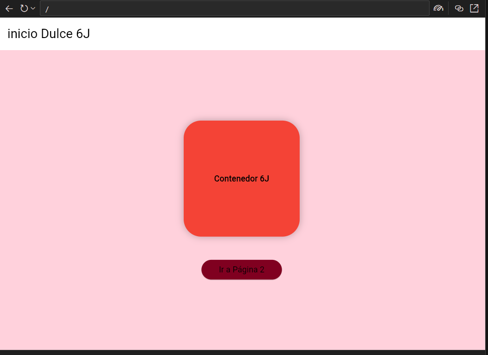
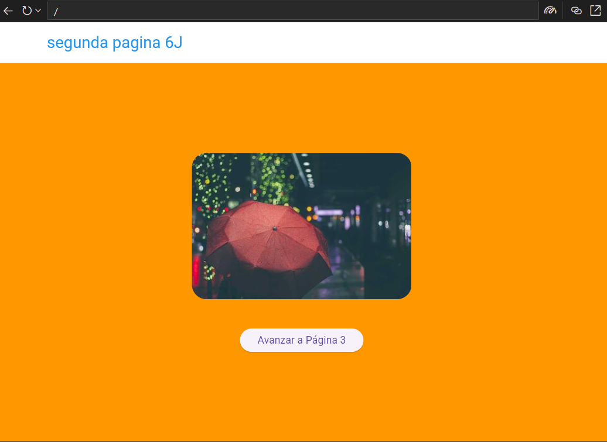
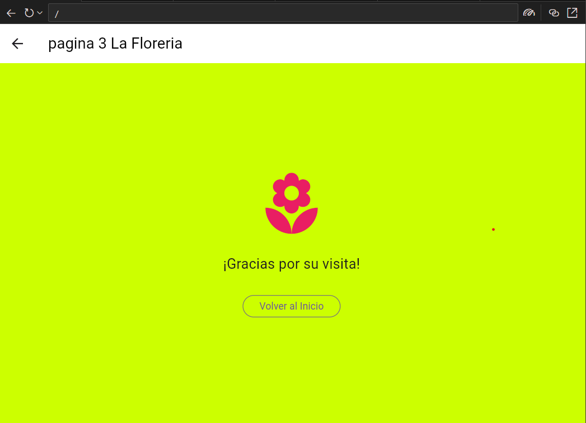
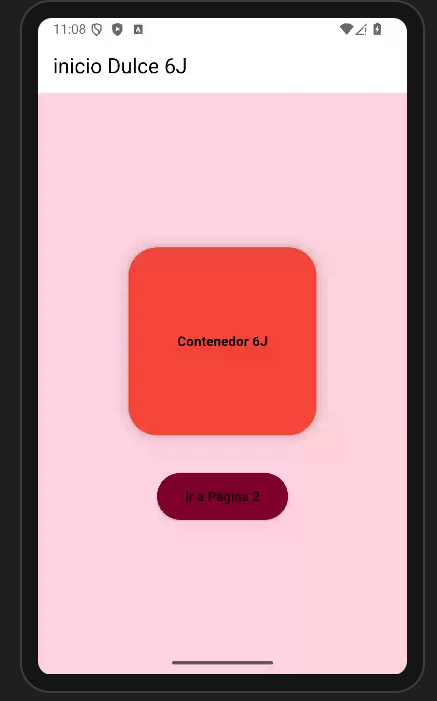
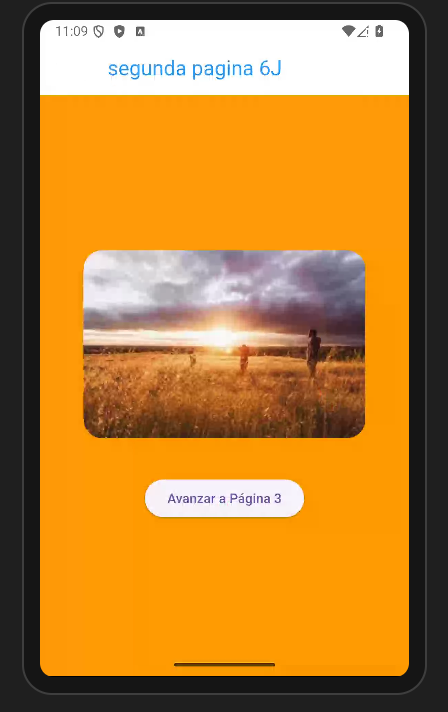
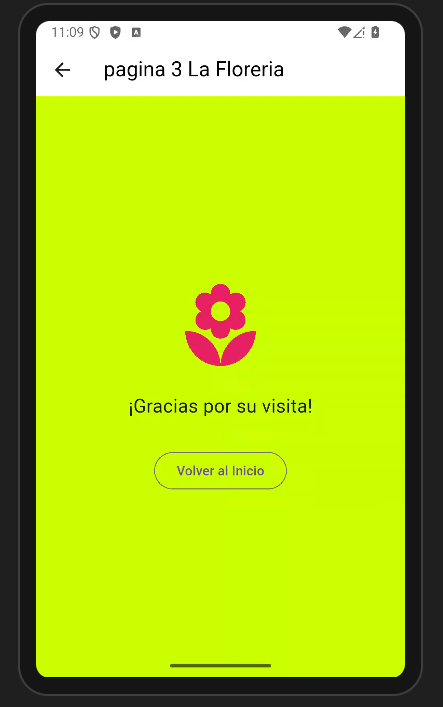

# myapp
#navegacion entre paginas con Flutter 
#Dulce Gomez 6J 
#mi prompt o pregunta AI
lenguaje Dart Flutter ,Nivel principiante ,navegacion entre 3 paginas utilizando rutas nombradas ,desde main llamar a la pagina1 ,en la pagina  en appbar mostrar el texto"inicio Dulce 6J" en color negro,color de fondo rosa pastel,iconos blancos ,en body un contenedor redondeado color rosa fuerte  200 por 200 con texto negro y centrado ,y un  boton de color amarillo texto negro para saleccionar pagina2,en la pagina 2 un appbar con texto "segunda pagina 6J "en color azul rey  ,fondo morado pastel y los iconos  en blanco ,en body una imagen desde la red y un boton para avanzar a la pagina 3,en la pagina 3 appbar con texto negro "pagina 3 La Floreria ",color de fondo verte pastel ,todo en un solo archivo,elegante y atractivo 

## 3  pantalla web

## 3  pantallas 

